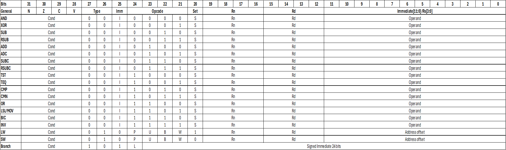

# Dual-Core Quad Hardware-Threaded ARM ISA-Compatible CPU

## Overview

This repository contains the design and implementation of a **dual-core, quad-hardware-threaded, ARM-ISA-compatible, pipelined processor**. The design integrates two independent quad hardware-threaded ARM ISA-compatible processors, with both cores sharing a common data memory. Together, the two cores support up to **eight concurrent hardware threads**, enabling multiple threads to execute instructions simultaneously and improving overall throughput and resource utilization.

Since both cores access the same data memory, additional mechanisms are required to detect and handle cross-core memory hazards, ensuring a consistent view of shared memory and maintaining correct program execution.

The processor is written in Verilog and targets Xilinx FPGAs. The implementation has been tested on the NetFPGA v2 platform.

## Instruction Encoding

<!-- TODO: add ISA/instruction encoding diagram image -->

All instructions are 32 bits wide with a common field layout:

| Bits    | 31:28 | 27:26 | 25  | 24:21    | 20  | 19:16 | 15:12 | 11:0                |
|---------|-------|-------|-----|----------|-----|-------|-------|---------------------|
| Field   | Cond  | Type  | Imm | Opcode   | Set | Rn    | Rd    | Operand / Rs / Offset |

- **Cond** — 4-bit condition field, evaluated against the NZCV flags to decide whether the instruction executes
- **Type** — top-level instruction class (`00` = data processing, `01` = load/store, `10` = branch)
- **Imm** — selects between register operand (`Rs`, bits [3:0]) and immediate operand (bits [11:0]) for data-processing instructions
- **Opcode** — selects the specific ALU/data-processing operation
- **Set** — when asserted, the instruction updates the NZCV flags
- **Rn** — first source register
- **Rd** — destination register (data processing) or source/destination register (load/store)
- **Operand / Address offset** — immediate value, shifted register, or memory addressing offset depending on instruction class

### Data Processing (Type = `00`)

| Mnemonic | Opcode [24:21] | Operation                  |
|----------|----------------|-----------------------------|
| AND      | `0000`         | Rd = Rn & Operand            |
| XOR      | `0001`         | Rd = Rn ^ Operand            |
| SUB      | `0010`         | Rd = Rn − Operand            |
| RSUB     | `0011`         | Rd = Operand − Rn (reverse subtract) |
| ADD      | `0100`         | Rd = Rn + Operand            |
| ADC      | `0101`         | Rd = Rn + Operand + Carry    |
| SUBC     | `0110`         | Rd = Rn − Operand − !Carry   |
| RSUBC    | `0111`         | Rd = Operand − Rn − !Carry   |
| TST      | `1000`         | Rn & Operand (flags only, no writeback) |
| TEQ      | `1001`         | Rn ^ Operand (flags only, no writeback) |
| CMP      | `1010`         | Rn − Operand (flags only, no writeback) |
| CMN      | `1011`         | Rn + Operand (flags only, no writeback) |
| OR       | `1100`         | Rd = Rn \| Operand           |
| LSL/MOV  | `1101`         | Rd = Operand (optionally shifted) |
| BIC      | `1110`         | Rd = Rn & ~Operand (bit clear) |
| INV      | `1111`         | Rd = ~Operand (bitwise NOT)  |

All data-processing instructions update the NZCV flags when **Set** (bit 20) is asserted. `TST`, `TEQ`, `CMP`, and `CMN` always compute their result for flag-setting purposes only and never write back to `Rd`.

### Load/Store (Type = `01`)

| Mnemonic | Bit 24 (Imm) | Bits [23:20] (P, U, B, W) | Operation |
|----------|--------------|----------------------------|-----------|
| LW       | `0`          | P, U, B, W, **L=1**        | Rd = Mem[Rn + Address offset] |
| SW       | `0`          | P, U, B, W, **L=0**        | Mem[Rn + Address offset] = Rd |

- **P** — pre/post-indexed addressing select
- **U** — up/down (add/subtract offset)
- **B** — byte/word access size
- **W** — writeback of the computed address into `Rn`
- **L** — load (1) vs. store (0), distinguishing `LW` from `SW`

### Branch (Type = `10`)

| Field          | Bits     | Description |
|----------------|----------|--------------|
| L              | `25`     | Link bit — when set, stores the return address (branch-and-link) |
| Signed Immediate | `[23:0]` | 24-bit signed offset, sign-extended and shifted for word alignment, added to the PC |

Branches are conditionally executed based on the 4-bit **Cond** field evaluated against the current NZCV flags (e.g. `EQ`, `NE`, `GT`, `LT`, always/never, etc.), matching the condition-code scheme of classic ARM branch instructions.

## Architecture

The dual-core processor consists of two quad hardware-threaded, pipelined processors that share a common data memory. A control logic block manages memory arbitration and maintains coherence, ensuring both cores have a consistent view of the shared memory.

### Quad-threaded 6-stage pipelined core datapath

The full datapath is organized around five pipeline register boundaries — **IF/ID**, **ID/EX**, **EX/MEM1**, **MEM1/MEM2**, and **MEM2/WB** — each of which latches control and data signals between adjacent stages.

**IF stage:** The IF stage contains the `Thread ID` block, four `PC` blocks, and the `Instruction Memory (IMEM)`. The `Thread ID` block uses round-robin multithreading, where, once enabled, the thread ID increments from 0 to 3 before wrapping back to 0. The current `thread_id` is propagated through all pipeline stages to identify which thread is executing at each stage. Based on the `thread_id`, the corresponding PC is selected. During stalling or branching, only the PC belonging to the affected thread is updated, while the remaining threads continue execution normally. This keeps each instruction stream independent. The `PC` block is controlled by the `PC_stall`, `PC_enable`, `Branch`, and `Branch_address` inputs and outputs the current `PC (31:0)`. This value is supplied to the **Instruction Memory (IMEM)**, where `PC[10:2]` is used as the instruction address. IMEM also includes `Instruction_address`, `Instruction`, `Instruction_write`, and `wb` ports for external instruction loading. The fetched instruction, corresponding `PC` value, and `thread_id` are then latched into the **IF/ID** register.

**ID stage:** The instruction from the **IF/ID** register is decoded by the `Control Unit`, which generates the required control signals. Simultaneously, the instruction's register fields are supplied to the `Register File (RF)`. There are four register files, one for each thread. Since each thread has its own register file, there is no context-switching overhead or shared register state to save or restore. The current `thread_id` selects which register file is used for register reads and write-back operations. The selected register file reads two operands, `Read data 0 (64)` and `Read data 1 (64)`, from addresses `Reg 0 addr` and `Reg 1 addr`, respectively. The immediate field is sign-extended (`Sign Extend`, 32-bit result), shifted left by 2 (`<<2`) for word alignment, and added to `PC (32)` using the `Adder (+)` to generate the `Branch address (32)` (`PC` is used instead of `PC+4` due to IMEM BRAM latency). There are four independent sets of `NZCV` flags, one for each thread. The flags for the current thread are compared against the instruction's condition field to determine whether a branch should be taken, preventing flag updates from one thread from affecting another during conditional branch evaluation. The register operands, `thread_id`, and control signals are then latched into the **ID/EX** register. Early branching is implemented by returning the `Branch address` and `Branch taken` signals to the corresponding `PC` block.

**EX stage:** The operands from the **ID/EX** register pass through forwarding multiplexers, which select between the register file outputs and forwarded values provided by the `Forwarding Unit (FU)` to resolve RAW hazards. The `ALU SRC` control signal selects either the forwarded register operand or the sign-extended immediate for immediate operations and address calculations. The `ALU` performs the operation specified by `ALU OP`, producing the result and updating the `NZCV` flags for the current thread. The `FU` monitors the **EX/MEM1**, **MEM1/MEM2**, and **MEM2/WB** pipeline registers to supply forwarded data when required, avoiding unnecessary stalls. The ALU result and associated control signals are then latched into the **EX/MEM1** register, while the updated `NZCV` flags are forwarded to the **ID** stage for branch condition evaluation.

**MEM1 stage:** This stage contains the `Tag RAM` and `Data Cache Memory (DMEM)` for each core. The ALU result from the **EX/MEM1** register is used as the address for both the cache memory and the `Tag RAM`. During an `LW` operation, the `Tag RAM` checks for a cache hit by comparing the valid bit and tag bits for the corresponding address. If there is a cache hit, the data is sent to the next stage. Otherwise, a cache miss is detected, triggering a main memory access and a cache miss stall. During an `SW` operation, the register data is written to both the cache memory and the main memory, and the `Tag RAM` is updated with the new tag for the address. The relevant control signals, cache hit/miss status, memory address, and store data for main memory are then latched into the **MEM1/MEM2** register.

**MEM2 stage:** This stage acts as the interconnect between each core and the shared main memory. During an `LW` operation, data is read from the shared main memory when a cache miss occurs. During an `SW` operation, the store writes data to the shared main memory. If a cache miss occurs during a load, the data fetched from main memory is also written back to the cache, so that subsequent accesses to the same address can be served directly from the cache. Data from memory, the ALU, and other control signals will be passed to the next stage via the **MEM2/WB** register.

**WB stage:** The outputs of the **MEM2/WB** register are supplied to a final 2:1 multiplexer, which selects between the ALU result (`0`) and the memory read data (`MemData (32)`, `1`) under control of the `Mem2Reg` signal. The selected value becomes `wb data`, which is written back to the `Register File (RF)`. The `WReg_WE` and `WReg_address` control signals are also returned to the register file in the **ID** stage to complete the write-back operation.

**Hazard Detection Unit:** The `Hazard Detection Unit (HDU)` monitors pipeline dependencies to detect hazards that cannot be resolved through forwarding, such as load-use hazards. When a hazard is detected, it stalls the `PC` and **IF/ID** registers and inserts a bubble into the pipeline by preventing control signals from advancing, ensuring correct execution. Hazards are detected only within instructions from the same thread, preventing unnecessary stalls caused by inter-thread dependencies.

**Forwarding Unit:** The `Forwarding Unit (FU)` detects read-after-write (RAW) data hazards by comparing the source registers in the **ID/EX** register with the destination registers in the **EX/MEM1**, **MEM1/MEM2**, and **MEM2/WB** registers. When a dependency is found, it controls the forwarding multiplexers to route the most recent result directly to the ALU inputs, eliminating unnecessary pipeline stalls. Forwarding is performed only between instructions from the same thread, ensuring that the forwarded value always belongs to the correct thread and preventing data from one thread from being forwarded to another.

### Top-Level Integration

The top-level datapath consists of two cores, the control logic, the shared main memory, and multiplexers that connect the cores to the main memory interface. The two cores operate independently, each with its own instruction memory for executing separate instruction streams, while sharing a common `PC_enable` signal to start execution simultaneously. The primary control signals for main memory access are `MemWrite` and `CacheMiss`. In addition, the cores provide the memory address, write enable, and write data signals to the shared memory, while the main memory returns the read data.

The control logic block grants one of the cores access to the shared main memory by driving the multiplexers' select lines. By design, **Core 0** has a higher priority than **Core 1**, so during conflicts, Core 0 is granted access first. The control logic also handles cache-miss stalls, particularly when both cores request access simultaneously. In addition, it performs tag validation during cache write-back after a cache miss or when one core writes to a memory location that is already cached by the other core, maintaining cache coherence between the two cores.

## Repository Modules Overview

This repository contains all the hardware modules required to implement the dual-core, quad-threaded ARM ISA-compatible processor.

### Quad-Threaded 6-Stage Pipelined Core Datapath

#### IF — Instruction Fetch

* **`threadid.v`** — Generates the current `thread_id`. The `PC_enable` signal advances the thread ID, implementing a round-robin scheduler that cycles from 0 to 3 and then back to 0.

* **`program_counter.v`** — Implements the program counter (PC) for a single hardware thread. The `PC_enable` signal enables PC updates, while `PC_stall` freezes the PC during hazards detected by the HDU. When a branch is taken, the PC is updated with the `Branch_address`; otherwise, it advances to the next sequential instruction.

* **`mux4to1.v`** — Four-to-one multiplexer that selects the program counter based on the current `thread_id`.

* **`imem1.v` / `imem1.xco`** — Implements the instruction memory for a core. It stores the program instructions fetched by the PC, while the `.xco` file contains the Xilinx CORE Generator configuration for the underlying block RAM.

#### ID — Decode

* **`control_unit.v`** — Decodes the instruction opcode and condition fields and generates the control signals used throughout the pipeline, including register write, memory write, `ALU_OP`, `Mem2Reg`, `ALU_SRC`, and related control signals.

* **`register_file.v`** — Implements the general-purpose register file (RF). Provides two read ports for operands and one write-back port. Four instances are used, one for each hardware thread.

* **`HDU.v`** — Hazard Detection Unit. Detects load-use hazards between the ID and EX stages and stalls the pipeline only when the dependent instructions belong to the same thread.

* **`demux_address.v`** — Demultiplexer that routes the register read address ports to one of the four register files. The current `thread_id` of that stage is used as the select signal.

* **`demux_data.v`** — Demultiplexer that routes the write address, write data, and write enable signals to one of the four register files. The `thread_id` from the write-back stage is used as the select signal.

* **`mux_data.v`** — Multiplexer that selects the read data outputs from the four register files and forwards them to the pipeline. The current `thread_id` of that stage is used as the select signal.

#### EX — Execute
 
* **`ALU.v`** — Implements the arithmetic logic unit (ALU). It performs arithmetic and logical operations specified by `ALU_OP`, generates the `NZCV` condition flags, and computes effective addresses for data memory during load and store operations.

- **`FU.v`** — Forwarding unit. Resolves RAW data hazards by forwarding the EX/MEM1, MEM1/MEM2, and MEM2/WB results of the same thread back into the EX-stage operand muxes.
 
- **`FMP.v`** — Forwarding mux is used alongside the forwarding unit to select between register file outputs and forwarded values.

#### MEM1 — Cache Memory and Tag RAM

* **`dmem.xco`/`dmem.v`** - Data cache memory. Used for load and store operations. In case of a cache miss, then data from main memory is written back to the cache for future quick retrieval. The `.xco` file is the Xilinx CORE Generator configuration for the underlying block RAM.
* **`tagram.v`/`tagram.xco`** - Tag RAM performs cache tag lookup and validation. It compares the stored tag and valid bit with the requested address to determine whether a cache hit or cache miss has occurred. The `.xco` file is the Xilinx CORE Generator configuration for the underlying block RAM.
 
#### MEM2 — Main Memory access
 
* It contains the input/output ports and control signals required to access the shared main memory. It handles memory read and write operations and, on a cache miss, transfers data between main memory and the data cache.

#### WB — Writeback
 
- Writeback is handled by the final mux inside **`pipeline_datapath.v`**, which selects between the ALU result and the load memory value before driving the register file's write port in **`register_file.v`**.

### Top-Level Integration

* **`pipeline_datapath.v`** — The top-level pipeline module. It instantiates and connects every stage (IF, ID, EX, MEM1, MEM2, WB), along with the HDU, FU, and pipeline registers (**IF/ID**, **ID/EX**, **EX/MEM1**, **MEM1/MEM2**, and **MEM2/WB**) to form the complete datapath. The module provides the interface to the shared main memory, including the required address, data, and control signals. It also outputs the `CacheMiss` and `MemWrite` signals used by the top-level control logic for memory arbitration, and accepts a cache miss stall signal when the other core is accessing the shared main memory.

* **` control.v`** — Implements the top-level control logic for shared main memory access. It selects which core is granted access to the main memory by generating the select signals for the multiplexers. It also performs tag validation and notifies the cores when cache updates are required due to writes from the other core. In addition, it stalls a core when the other core occupies the shared main memory.

* **`main_dmem.xco`/`main_dmem.v`** - Data main memory. Shared main memory for both the cores. Fetches data in case of any cache miss by any of the cores, and data is written to this memory in SW operations. The `.xco` file contains the Xilinx CORE Generator configuration for the underlying block RAM.

